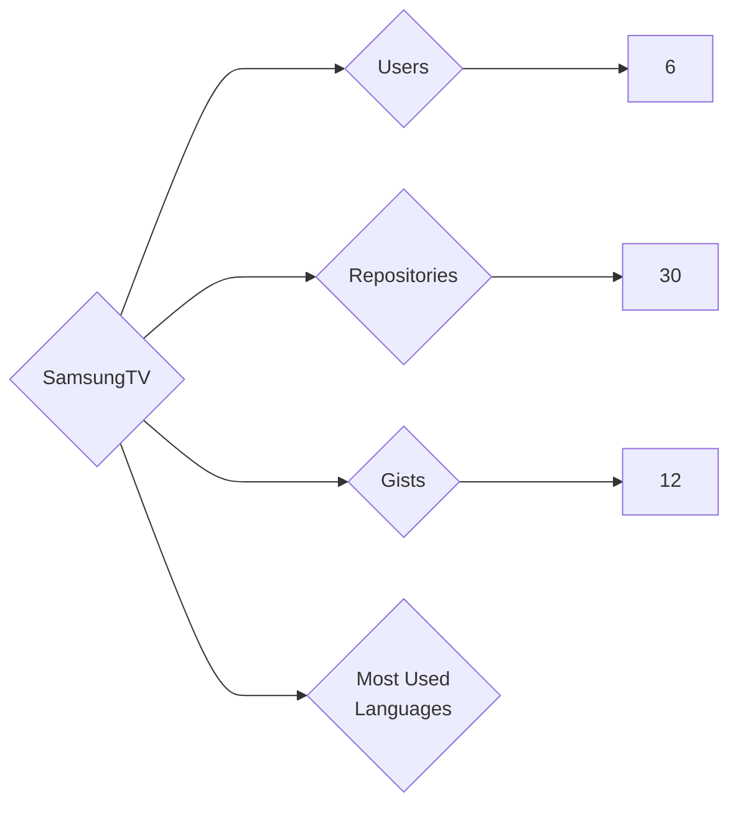

<h1 align="center">SamsungTV</h1>

```mermaid
graph LR
COMPANY_NAME{SamsungTV}
COMPANY_NAME ---> U{Users} ---> UN[6]
COMPANY_NAME ---> R{Repositories} ---> RN[30]
COMPANY_NAME ---> G{Gists} ---> GN[12]
COMPANY_NAME ---> ML{Most Used<br>Languages}
```
