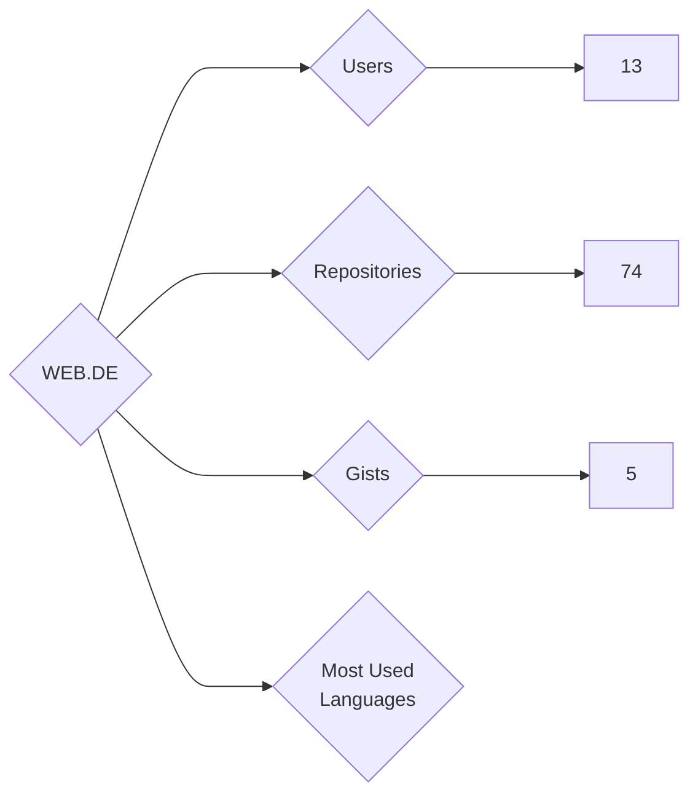

<h1 align="center">WEB.DE</h1>

```mermaid
graph LR
COMPANY_NAME{WEB.DE}
COMPANY_NAME ---> U{Users} ---> UN[13]
COMPANY_NAME ---> R{Repositories} ---> RN[74]
COMPANY_NAME ---> G{Gists} ---> GN[5]
COMPANY_NAME ---> ML{Most Used<br>Languages}
```
