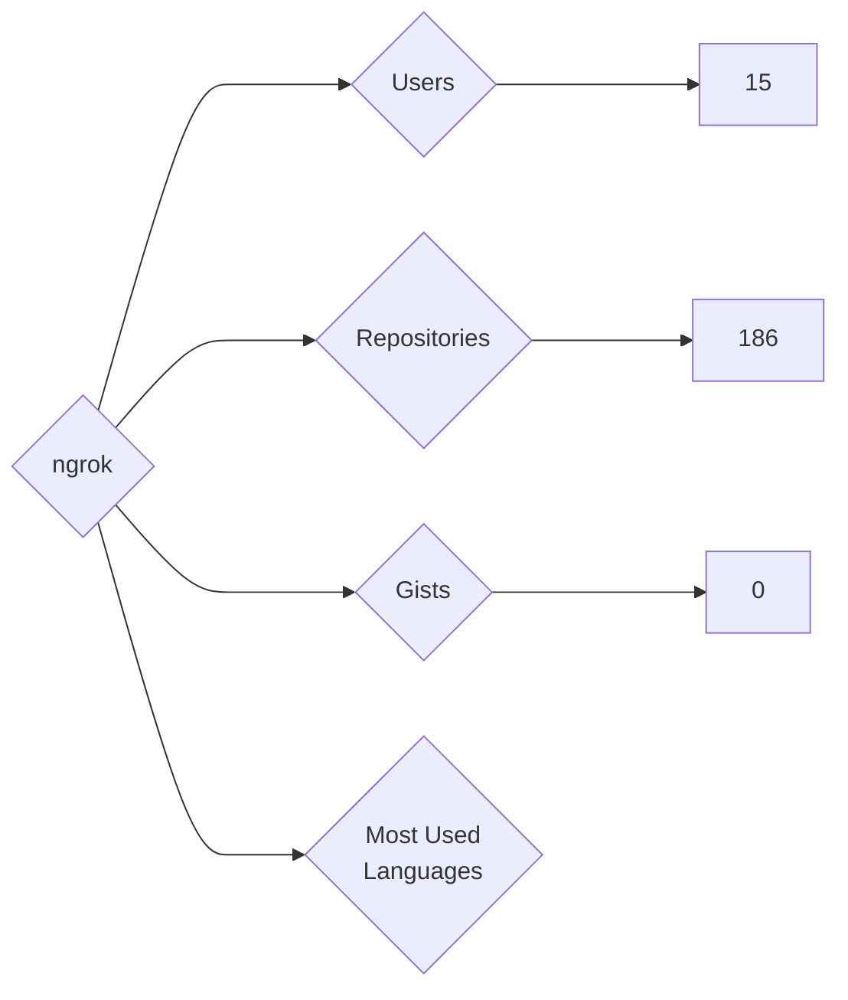

<h1 align="center">ngrok</h1>

```mermaid
graph LR
COMPANY_NAME{ngrok}
COMPANY_NAME ---> U{Users} ---> UN[15]
COMPANY_NAME ---> R{Repositories} ---> RN[186]
COMPANY_NAME ---> G{Gists} ---> GN[0]
COMPANY_NAME ---> ML{Most Used<br>Languages}
```
